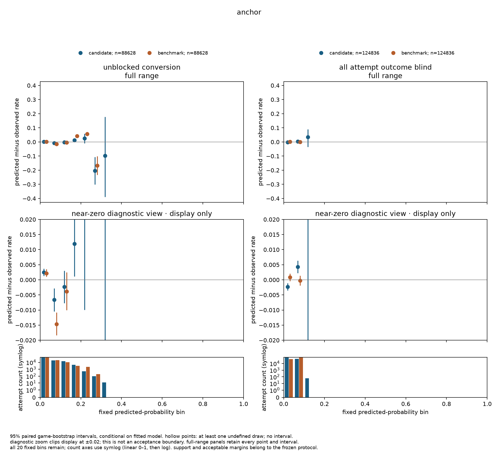
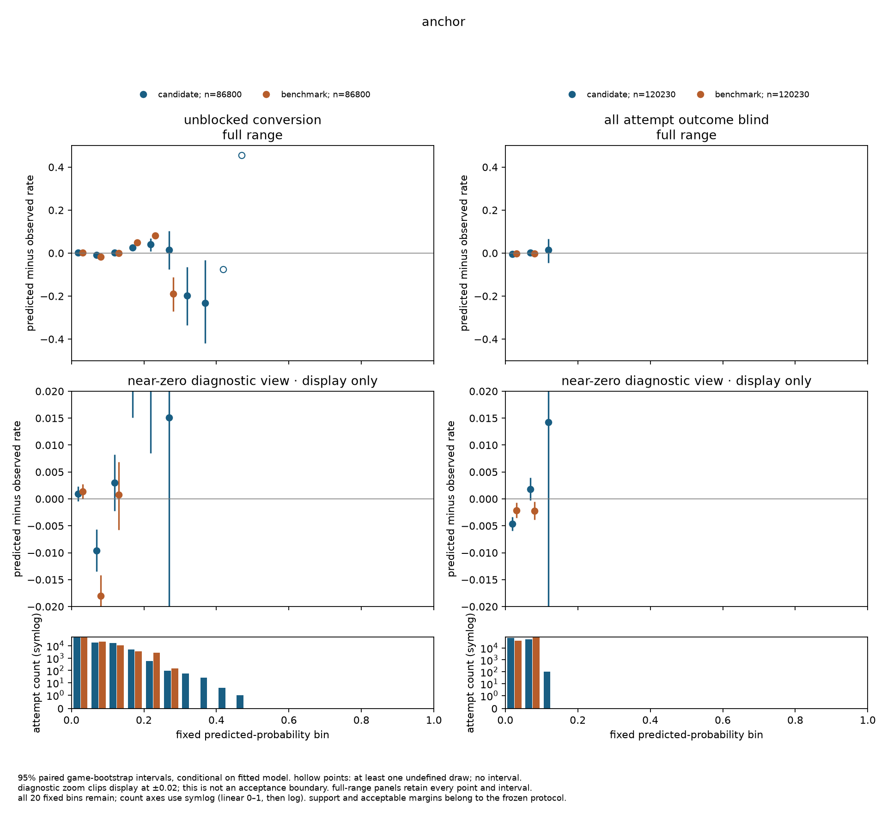
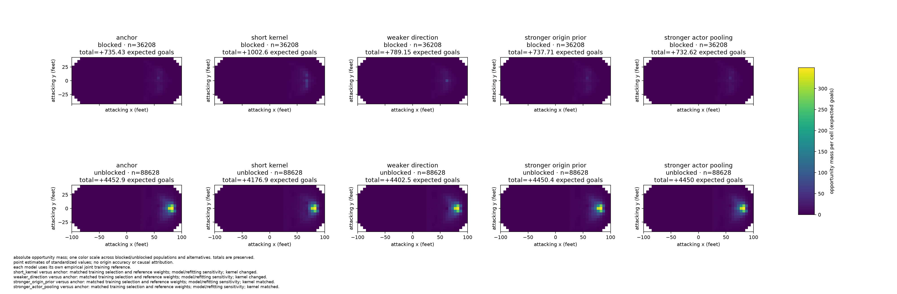
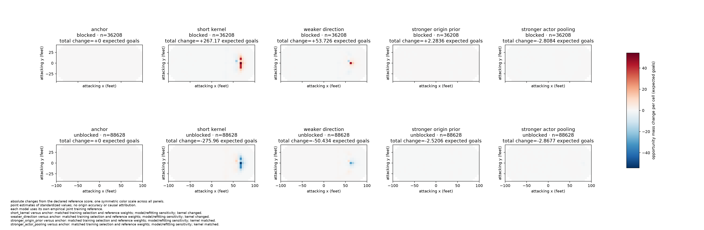
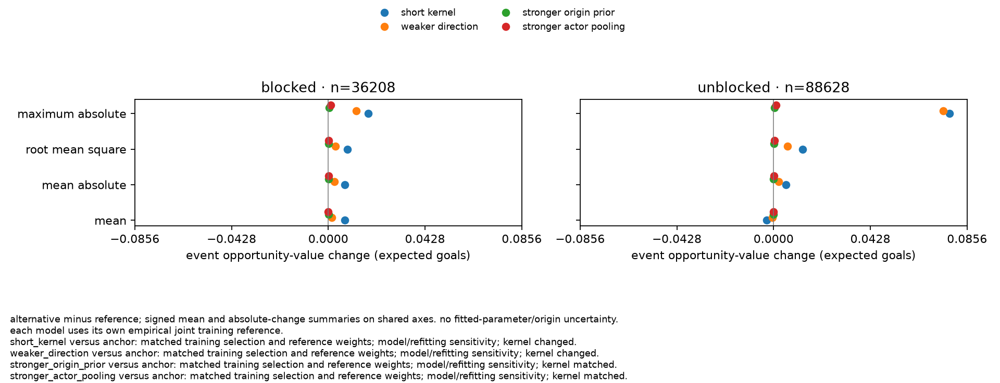
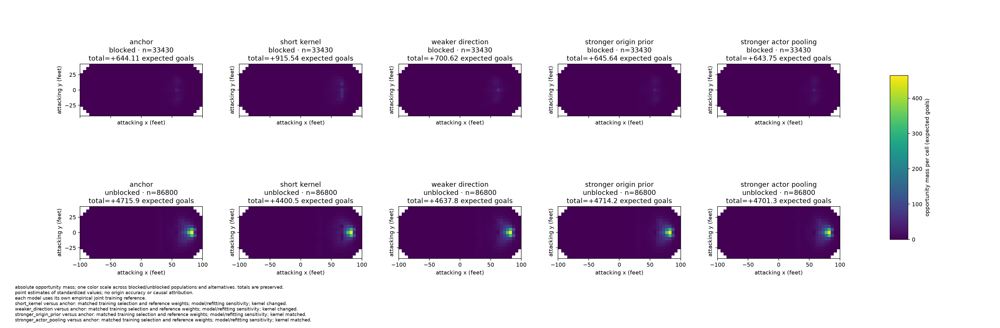
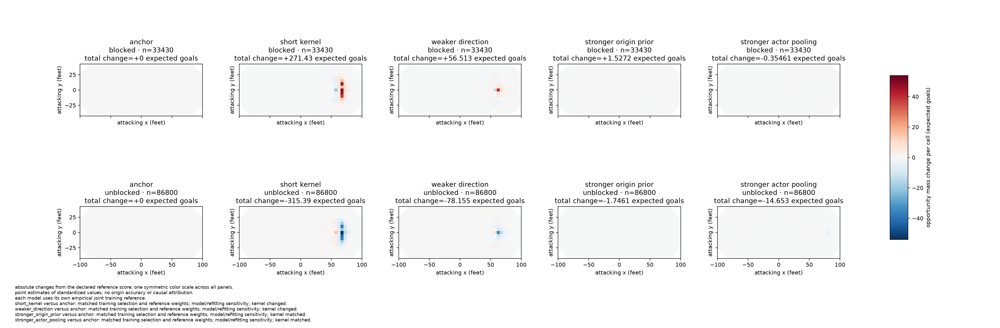
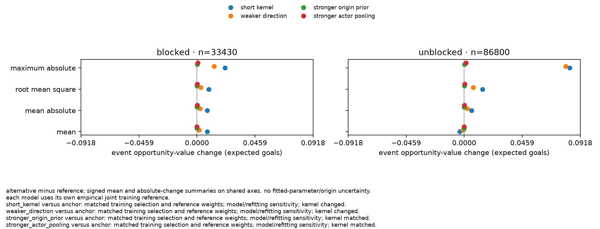

# chance-03b scientific decision

status: completed on 2026-09-30. **rejected for the declared all-attempt chance use.** conditional conversion beats its benchmark on confirmation, but decisively fails consequential conversion calibration and declared origin/value stability. all-attempt probability adequacy remains insufficient on confirmation; independent physical-origin accuracy remains insufficient. the conditional final retrospective fit and 04 handoff are withheld.

## population and evidence

fresh revised-data captures cover all 1,312 inventoried regular-season games in each of 2023–24, 2024–25 and 2025–26. all 19,692 source receipts were checked against preserved response bytes and requested scope. native admission parsed the twelve references and four game sources per game; the 3,936 game-summary captures remain explicitly `reference_only`. admitted parsed identities and game/reference dispositions are separately verified. no projected predecessor input entered the corpus; absent biographical values remained absent. this is retrospective analysis of corrected 2026 retrievals, not a historical forecast.

development fitted 2023–24 and assessed 2024–25. the frozen confirmation procedure fits both seasons and assesses the ordered 2025–26 inventory excluding `2025020001`, `2025020006`, `2025021094`, previously exposed during development. source-only confirmation audits occurred before fitted performance. the final fit is conditional on support and is withheld on rejection or insufficiency.

the [protocol](protocol.md) fixes five named recipes, the failed anchor primary, epsilon-zero proper-loss tests, calibration margins, consequential bins, value/origin perturbation budgets, reference definition and resampling. the anchor is unchanged; each of the four alternatives changes one existing quantity. none introduces a new likelihood, feature or grid. all sensitivity scores share the same selected events and eligible joint shooter/goalie reference within their training window. reference opportunity values are distinct from factual probabilities.

## coverage

| population | selected games | contributing games | recognized attempts | eligible unblocked | eligible blocked | outside 5v5 | unavailable |
|---|---:|---:|---:|---:|---:|---:|---:|
| development training, 2023–24 | 1,312 | 1,308 | 160,123 | 88,683 | 35,924 | 34,471 | 1,045 |
| development assessment, 2024–25 | 1,312 | 1,309 | 156,622 | 88,628 | 36,208 | 30,977 | 809 |
| confirmation training, both seasons | 2,624 | 2,617 | 316,745 | 177,311 | 72,132 | 65,448 | 1,854 |
| confirmation assessment, selected 2025–26 | 1,309 | 1,307 | 153,376 | 86,800 | 33,430 | 32,440 | 706 |

zero-contribution selected games remain in paired resampling. source-audit statistics on all 1,312 2025–26 games have separate denominators; they are not this held-out population. native reported membership determines eligibility even when shifts cannot establish elapsed exposure: 3,184, 6,778 and 1,338 eligible attempts respectively lack interval links in the first, second and selected third seasons. this study therefore cannot establish downstream event/exposure compatibility.

same-clock matching removes a selective population: development training has 606 unavailable attempts among 1,154 recognized eligible-or-unavailable attempts at clocks containing two attempts, versus 422 among 124,477 at single-attempt clocks. these denominators do not establish true-5v5 membership of unavailable rows or quantify performance bias. reconstruction/source records retain a defending-side conflict, seven timed failed-penalty-shot games across the full inventory, a contradictory non-goal clock and two shift-source defects. no study-selected repair or additional exclusion made the fits runnable.

## probability and calibration

conversion checks `r` conditional on an unblocked attempt at its recorded quantized location. the all-attempt probability additionally integrates the origin prior and unblocked probability: `sum(origin prior * u * r)`. improving conditional conversion alone cannot establish that composition. standardized reference opportunity has a separate reference population and cannot be calibrated against factual goals as though it were the same probability.

proper-loss differences are pooled candidate-minus-benchmark sums divided by pooled attempts; negative is better. intervals use 2,000 paired whole-game draws, `PCG64`, seed `3032026`, 95% pointwise linear percentile bounds, without simultaneous-coverage or multiplicity adjustment. zero-denominator draws make the interval null; empty or sparse bins are visible evidence gaps. intervals condition on fitted models and approximate independence between games, excluding fitting and origin uncertainty.

| development anchor quantity | estimate | 95% game interval | frozen requirement |
|---|---:|---|---|
| unblocked log-loss difference | −0.000544367 | [−0.000993667, −0.000088414] | supports zero excess under game approximation |
| unblocked brier difference | −0.000173072 | [−0.000259084, −0.000088484] | supports |
| all-attempt log-loss difference | +0.000368988 | [+0.000173056, +0.000562037] | rejects |
| all-attempt brier difference | +0.000041484 | [+0.000022247, +0.000062008] | rejects |

all five development recipes fail at least one proper-loss requirement. the first four have adverse all-attempt log-loss and brier intervals; doubled actor pooling has overlapping log loss and adverse brier. the primary remains anchor by the predeclared failed-candidate rule. choosing the least bad recipe would not establish adequacy.

overall development calibration lies within ±0.0025 in both populations. consequential conversion bins 1 and 3 overlap the ±0.01 bin boundary, so adequacy is unestablished despite acceptable pooled calibration. bin 5 has 99 attempts and a wholly adverse interval; it remains a visible sparse diagnostic rather than a newly invented primary gate. all-attempt consequential bins 0 and 1 fit their margins. observed goal counts never define exclusions or support.

bounded native replay reconciles five groups selected from development aggregate discrepancies and frozen before confirmation to saved native aggregates, then constructs per-game intervals. development intervals are post-selection diagnostics, not multiplicity-adjusted new primary tests; unchanged confirmation repetition independently checks those same groups. backhand conversion discrepancy is +0.0167846 [0.0101898, 0.0231719], snap −0.0202089 [−0.0240170, −0.0166832], tip-in +0.0460454 [0.0405886, 0.0512324]. these are consequential errors beyond the existing diagnostic margin. improved snap/tip proper loss does not establish calibration. forward all-attempt losses decisively worsen; defender loss intervals overlap zero. replay/source examples explain inspected fields, not causal isolation or independent physical release locations. missing shot type remains unknown; inspected missing-type goals include own-goal/defensive-deflection descriptions. the all-target shot-type summaries condition on current unblocked outcome and are descriptive, not valid outcome-blind calibration gates.

actual-date temporal checks preserve all calendar days and fixed week/fortnight clusters. development anchor conversion log-loss weekly interval [−0.001066907, +0.000025530] overlaps zero; fortnight support cannot erase that warning. both all-target losses remain adverse under both blockings. monthly drift limits broad claims. seven/fourteen days are sensitivity choices, not certified dependence horizons or a way to rescue a primary failure.

the development panels show fixed-bin calibration; pooled overall results are stated above. the additional ±0.02 view only enlarges the display; the protocol's margins and support rules determine adequacy.

## frozen confirmation

all five recipes completed native fit/evaluate/score and the retained comparison at clean `b1d127b0d71d90383a7c7d60ddc5f51fd5a69da9`. all ten starts converged; no budget, population, recipe, primary or threshold changed. independent audits reproduced every saved loss/calibration interval and all streamed sensitivity arithmetic. confirmation supplies no new winner: the failed development anchor remains primary.

| confirmation anchor quantity | estimate | 95% game interval | frozen requirement |
|---|---:|---|---|
| unblocked log-loss difference | -0.001833777 | [-0.002331317, -0.001314241] | supports under game approximation |
| unblocked brier difference | -0.000428839 | [-0.000525189, -0.000330188] | supports under game approximation |
| all-attempt log-loss difference | +0.000213302 | [-0.000021617, +0.000434231] | insufficient; overlaps zero |
| all-attempt brier difference | +0.000014533 | [-0.000009434, +0.000037170] | insufficient; overlaps zero |

all five confirmation recipes have overlapping all-attempt proper-loss intervals; none establishes the zero-excess requirement. this is insufficient evidence, not a repeated decisive loss rejection. development's adverse loss evidence remains part of the cross-season judgment. improved conversion loss cannot waive calibration or spatial failures.

| confirmation anchor calibration | attempts / contributing games | predicted-minus-observed | 95% game interval | frozen requirement |
|---|---:|---:|---|---|
| conversion overall | 86,800 / 1,307 | +0.000527804 | [-0.000979586, +0.002165016] | supports ±0.0025 |
| all-attempt overall | 120,230 / 1,307 | -0.001914444 | [-0.003048565, -0.000705983] | insufficient; overlaps −0.0025 |
| conversion bin 0 | 46,423 / 1,307 | +0.000951319 | [-0.000406630, +0.002282179] | supports |
| conversion bin 1 | 18,505 / 1,307 | -0.009568879 | [-0.013478425, -0.005650792] | insufficient; boundary overlap |
| conversion bin 2 | 16,183 / 1,307 | +0.003038103 | [-0.002221779, +0.008198042] | supports |
| conversion bin 3 | 4,941 / 1,233 | +0.024715014 | [+0.015062137, +0.034538624] | rejects; wholly above +0.01 |
| all-attempt bin 0 | 69,678 / 1,307 | -0.004639358 | [-0.005940196, -0.003316760] | supports |
| all-attempt bin 1 | 50,452 / 1,307 | +0.001816870 | [-0.000247653, +0.003951202] | supports |

conversion bin 3 contains 5.69% of conversion attempts and 15.38% of predicted goal mass. its 4,941 attempts and 1,233 contributing games meet the frozen support minima; its interval lies entirely above +0.01. this is an applicable decisive failure. bin 1 has adequate counts but inconclusive precision. no new confirmation bin meets the 5% trigger: the required sets remain conversion `0,1,2,3` and all-attempt `0,1`. sparse conversion bins 6 and 7 are adverse diagnostics, not added gates. bins 8/9 have null intervals with 34/715 undefined draws; empty bins retain 2,000 undefined draws. all twenty remain visible.

full-range panels retain the tails; the near-zero view is display-only. counts, uncertainty, consequence and acceptable margins are separate conditions.

### fixed contextual and temporal checks

all five frozen groups reconcile to the saved native aggregates and all 1,309 game ledgers. these seven group/population interval sets use the same game method; they do not add new primary tests or establish simultaneous coverage. the three fixed shot-type calibration failures repeat:

| conversion group | attempts / contributing games | predicted-minus-observed | 95% game interval |
|---|---:|---:|---|
| backhand | 6,501 / 1,294 | +0.020240734 | [+0.013645528, +0.026324199] |
| snap | 21,662 / 1,299 | -0.017089619 | [-0.020603494, -0.013485653] |
| tip-in | 8,344 / 1,302 | +0.056989460 | [+0.051943375, +0.062156748] |

each carries more than 5% of conversion attempts and predicted mass. both snap/tip proper losses improve, while backhand proper-loss intervals overlap zero; none of those comparisons waives the calibration errors. forward conversion losses improve; defender conversion intervals overlap zero, including brier's small positive upper bound. both forward and defender all-attempt loss intervals overlap zero. six unknown-role attempts remain in the native confirmation totals. [aggregate subgroup evidence](subgroups.md) shows the saved primary summaries for both windows, including season, score, home/away, role, type and stage-specific actor evidence; those aggregates do not provide additional clustered intervals.

other existing aggregates remain consequential unresolved diagnostics: slap conversion has 9,250 attempts and mean calibration −0.0109889; unseen-shooter all-target groups exceed 5% of attempts and have positive mean excess loss. no new clustered group intervals or gates were selected after confirmation. the complete native tables retain these limits; the broad use is already rejected.

confirmation source checks preserve fifteen eligible unblocked goals with missing shot type. the first inspected missing-type goal (`2025020184`, index `158`) has no type or own-goal descriptor; the next two (`2025020282`, index `282`; `2025020307`, index `14`) explicitly say own goal. these are selected diagnostic source cases, not representative release-location annotations. development's inspected own-goal pattern cannot be generalized to every missing type. no type is filled, and these rows remain included.

actual-date temporal repetition preserves 192 calendar days, 28 weeks (two empty) and 15 fortnights. the supplementary primary intervals are:

| proper-loss difference | weekly 95% interval | fortnight 95% interval |
|---|---|---|
| conversion log loss | [-0.002533775, -0.001160500] | [-0.002525571, -0.001110914] |
| conversion brier | [-0.000564079, -0.000295065] | [-0.000564743, -0.000287488] |
| all-attempt log loss | [+0.000005856, +0.000434614] | [-0.000012374, +0.000467091] |
| all-attempt brier | [-0.000007328, +0.000037000] | [-0.000009439, +0.000039489] |

conversion loss improvement persists under these two blockings. weekly all-attempt log loss is adverse while fortnight overlaps zero; the primary game-resampled result remains insufficient. neither choosing the favorable blocking nor choosing the adverse one replaces the predeclared primary comparison. seven/fourteen days remain assumed sensitivity horizons, not certified independence. all-target overall calibration overlaps its lower boundary under both blockings. daily correlations and monthly drift are descriptive, not causal explanations.

## origins and standardized values

four block examples selected before fitted maps cover long, wing, central and teammate-blocked geometry but come from one game. queried official replay endpoints returned existing event metadata or unavailable responses, supplying no independent release-location annotations or uncertainty. that search does not prove no replay exists anywhere. these source cases and plausible finite-rink kernel geometry cannot establish physical accuracy. independent origin evidence was classified insufficient before confirmation and cannot be rescued by probability performance.

the pre-map bounded source examples are recorded block evidence in an attacking frame, not observed shooting origins:

| source condition | game / source index / event | recorded block location (feet) | independent release and uncertainty |
|---|---|---|---|
| own_half | no eligible example in the bounded selection | null | unavailable |
| long_attempt | `2023020001` / `128` / `542` | (48, 0) | unavailable |
| wing | `2023020001` / `132` / `653` | (56, 26) | unavailable |
| central | `2023020001` / `26` / `233` | (79, 3) | unavailable |
| teammate | `2023020001` / `108` / `157` | (76, -19) | unavailable |

the source snapshot predates replay seeking; its historical `not yet sought` fields remain unchanged. the separate replay-search record supplies the later unavailable-evidence result. synthetic kernel geometry checks are labelled geometry calculations, not raw or independently measured origins.

all four perturbations refit the model. within each window their training selection and empirical joint reference weights match anchor; the two kernel perturbations also change the assumed geometric law. comparisons therefore identify combined kernel/refit sensitivity, not isolated causal kernel effects. absolute spatial mass and event-value changes preserve totals and use shared scales, separately for blocked/unblocked attempts.

on development, shortening the distance scale changes blocked total opportunity by +36.3%, blocked spatial absolute mass by 64.4% and mean blocked total variation by 0.424. unblocked total changes −6.2%, with maximum event-value change 0.0779 expected goals. blocked and unblocked signed totals nearly cancel; cancellation is no stability evidence. weaker direction also fails multiple blocked limits and the unblocked maximum. stronger origin regularization fails maximum blocked variation; doubled actor pooling passes the point sensitivity limits but still fails probability adequacy. these reject stability under the declared perturbations, not independently observed physical origin error. the named range is a stress experiment, not a confidence region.

these are common-event comparisons within the development window. confirmation has different events and its own two-season joint reference; cross-window panels are not paired-event contrasts. every plotted alternative includes refitting. the external reviews retain all candidate calibration figures and complete numerical evidence.

### confirmation sensitivity

reference totals are 644.108183 blocked and 4,715.907962 unblocked expected goals of standardized opportunity. every alternative shares the same confirmation events and two-season joint reference. total changes are signed; their gate uses absolute change. spatial change is the absolute cell-mass difference divided by the primary total, preserving both shape and scale.

| alternative / population | mean absolute event change | maximum absolute event change | total change | spatial absolute change / primary total | origin tv mean / maximum |
|---|---:|---:|---:|---:|---:|
| short_kernel / blocked | 0.0081488 | 0.0221318 | +42.140% | 71.808% | 0.45138 / 0.77110 |
| short_kernel / unblocked | 0.0059527 | 0.0834368 | -6.688% | 10.956% | 0.00000 / 0.00000 |
| weaker_direction / blocked | 0.0023264 | 0.0135735 | +8.774% | 29.718% | 0.32740 / 0.68528 |
| weaker_direction / unblocked | 0.0024175 | 0.0801061 | -1.657% | 4.450% | 0.00000 / 0.00000 |
| stronger_origin_prior / blocked | 0.0000462 | 0.0001224 | +0.237% | 0.341% | 0.00272 / 0.03394 |
| stronger_origin_prior / unblocked | 0.0000266 | 0.0002824 | -0.037% | 0.049% | 0.00000 / 0.00000 |
| stronger_actor_pooling / blocked | 0.0001015 | 0.0007296 | -0.055% | 0.431% | 0.00725 / 0.02114 |
| stronger_actor_pooling / unblocked | 0.0002784 | 0.0015150 | -0.311% | 0.509% | 0.00000 / 0.00000 |

event changes are in expected goals. the frozen limits are mean/max `0.0025/0.02`, absolute total `5%`, spatial absolute change `10%`, and blocked tv mean/max `0.10/0.30`. short kernel fails every blocked limit and all four unblocked value limits. weaker direction fails blocked total/spatial/tv limits and unblocked maximum value; its confirmation mean changes satisfy their limits. stronger origin prior and actor pooling pass these confirmation point-sensitivity limits. that does not erase development's prior maximum-tv failure or establish physical accuracy.

unblocked origins remain the same recorded point masses, yet their values change with the refitted probability surfaces. zero origin tv cannot certify stable value. summed signed population changes conceal cancellation; separate populations, event maxima and absolute spatial mass are necessary.

## operation and limitations

native software, source integrity, measurement, interruption recovery and temporary red/green/refactor integration/live checks are recorded in [verification](verification.md). the retained comparison entry point reads saved attributable evidence; it does not fit, select thresholds or issue a verdict. temporary tests and test-only dependencies are deleted; actual fixtures and scientific facts remain.

resource measurements cover real preparation/fits/assessment/scoring/comparison, not fixture extrapolation. costly accepted em progress is recoverable explicitly into a new directory under the original clean implementation/input/config identities; an interrupted inner solve restarts. fixed penalties carry unscaled into the larger window. parallel independent fits use available cores/memory; their wall times reflect contention.

three recent seasons and a small named candidate set leave broader horizons and estimator families untested. strict zero-excess gates leave near ties inconclusive. practical tolerances and consequence thresholds are declared judgments, not universal constants. source gaps, sparse tails, temporal dependence and missing physical-origin evidence limit interpretation independently of software correctness. 03b does not validate player effects, peer parity, publication or a causal contribution decomposition.

## retained evidence

all paths below are relative to `/Volumes/Expansion/hockey-stats/chance/03b-20260930/`. [verification](verification.md) gives full native costs, red/green/refactor checks and independent audit scope. the frozen [protocol](protocol.md) binds selections, configurations and admitted corpus hashes; the final evidence below does not rewrite that historical freeze. the comparison records all consumed model/assessment/score/selection digests. full external results remain alongside their immutable inputs; the eight adjacent figures are byte-identical copies of the native reviews.

| evidence | relative path | sha256 |
|---|---|---|
| acquisition response and scope checks | `inputs/acquisition-provenance.json` | `e173f0f89f0f71af883afa0df8efb782ff5b5049cf8463035627149c515e8aa6` |
| missing biographical values | `inputs/acquisition-missing-values.json` | `ea2b46d2f95f07264eb3f184d5a3eac4e882db0cf29899a6ff68c54d5f4417ad` |
| immutable confirmation freeze | `inputs/confirmation-freeze.json` | `358f0cc502ce5d1e42620c94ac3e877e78aec5ea28d765f5512bac247c21d7e8` |
| immutable protocol snapshot | `inputs/confirmation-protocol.md` | `7cb4a06a96adf17f9c7c6bbd3c96f0e985074c784fadcdf54ff16344839223ee` |
| development comparison | `review/development-plot-verification/comparison.json` | `c3f50f3631089a5eb8c811697b3d283ed993a50ae9260b43d646d1221904703c` |
| confirmation evidence selection | `inputs/confirmation-evidence.json` | `5668aeedff822eed53fe83864b94b421e317d6dddb1f01baa538ecd44dc01a02` |
| confirmation comparison | `review/confirmation/comparison.json` | `bc1ac96b4b52e69be0cd0d18b1741a426fc71385925c7b0abeb8157631c07884` |
| all five fit identities and costs | `inputs/confirmation-recipe-costs.json` | `5aecf37bbad8f18bda0f717852a9122ea8db73fe12600b5973359ebf3a87f9cb` |
| all five assessment/scored-stream audits | `inputs/confirmation-artifact-verification.json` | `6518def4a42fe3912df723d6d3d9e4d277044bbe625a86d9d5e2ea4dca7dceb9` |
| independent comparison mathematics | `inputs/confirmation-numerical-verification.json` | `8db9e662b63d9fa12b36ba9555bf119bcab82991a9f1775cb153605734f85d09` |
| supplemental execution facts | `inputs/confirmation-attribution-verification.json` | `4ab727822dfeee11c7c3704d88a0b9ce3c3d09025e97e1277510bc79e5d9b1b2` |
| independent supplemental closure | `inputs/confirmation-supplemental-independent-verification.json` | `aa047e1f880d2c792857d15dd9a03073dbbf34cdd3dcc8037cd724d8fec91317` |
| compact confirmation diagnostic facts | `inputs/confirmation-diagnostic-summary.json` | `4094451be0c784b4a230d3f9c675411f2066ae218e02b6558555ce04d97968ac` |
| native confirmation subgroup replay | `subgroups-confirmation/anchor/subgroups.json` | `53d20814223f98dfce8046f4d9edb1f571f7ed97edf1c7e201572e13802a7949` |
| confirmation diagnostic source cases | `subgroups-confirmation/anchor/source-cases.json` | `4219812e48f76eba12e2e13584385b399f3b1178b8bc8f35b71f019037a63cb3` |
| confirmation raw-source hand-checks | `source-handchecks-confirmation-subgroups/hand-checks.json` | `56aa55688395f2e64f6a05645da486094d29a1be5fd18fa44c748b274e6c621b` |
| pre-map blocked source examples | `inputs/origin-examples.json` | `cbf6e15e3debbfc23ee29d280e34fe9fc0bdd91d0c9d9b0eb14a03228c197374` |
| subsequent attributable replay search | `inputs/origin-replay-search/search.json` | `5eae3934b8271cf8ebf5961bdbbe50608f939fcd7d5794631a2eefe71516563f` |
| source facts across all three cohorts | `inputs/attribution-final-notes.md` | `4ad8f609424c7b67c1c9e8c994acd836071b23502664d17e0feeca6ef5d6a4c2` |

| confirmation model | relative path | sha256 |
|---|---|---|
| anchor | `fits/confirmation-anchor/model.json` | `737020776fd18ec0b76cdef721ff31e14d45c482c39cb04336230b514077fd69` |
| short_kernel | `fits/confirmation-short_kernel/model.json` | `e49ba0e0008403d4d71f2752687a7bf53aaf8cd4ac2bc82656dc24d4c4947805` |
| weaker_direction | `fits/confirmation-weaker_direction/model.json` | `f9ec794a58c7ecc1d85d8cbba171f97079fbe0fce6cf10db4e4258489d7ea5f8` |
| stronger_origin_prior | `fits/confirmation-stronger_origin_prior/model.json` | `d8c2f9543f4ca71a6391b76cef40da53877cdf7e0d89be1aa327bef961bd89a9` |
| stronger_actor_pooling | `fits/confirmation-stronger_actor_pooling/model.json` | `d209843ec369ebaecf2247cfc78f8d4cf0a2e4463a54db232fe6ea5fb4a4dda6` |

## decision and next work

the declared all-attempt use is rejected by consequential calibration and sensitivity failures. factual conversion loss has conditional support; outcome-blind all-attempt probability adequacy remains insufficient on confirmation; independent origin accuracy remains insufficient. these are separate judgments. no final all-data fit or compatible 04 handoff is produced because the support precondition is false.

next scientific work is explicit: [all-attempt probability](../../issues/all-attempt-probability.md), [conversion calibration](../../issues/conversion-calibration.md), [origin/value sensitivity](../../issues/origin-value-sensitivity.md), and [independent location evidence](../../issues/shot-location-evidence.md). source-contract defects and event/exposure compatibility remain separately recorded. a reviewed revision needs separately justified confirmation; tuning on these 2025–26 results makes them development evidence. the product's blocked-attempt scope remains settled. publication and archive cleanup require their own work and authorization.
