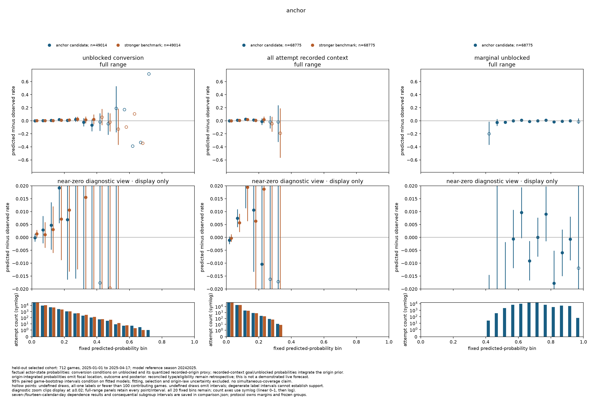
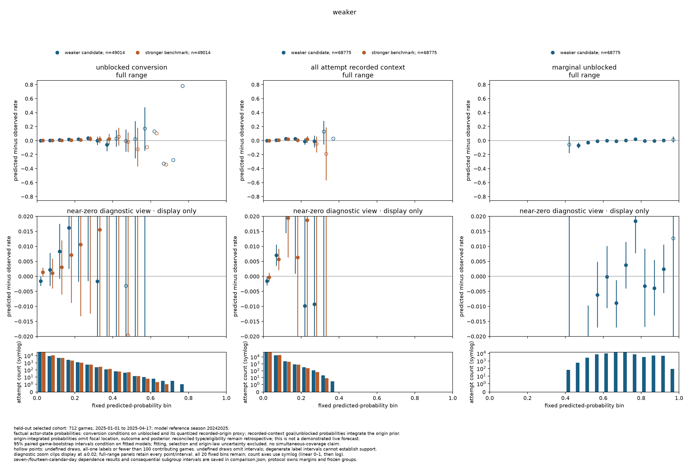
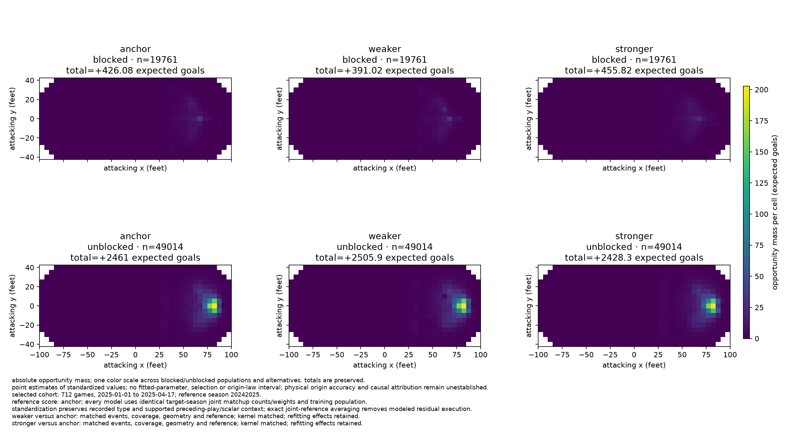
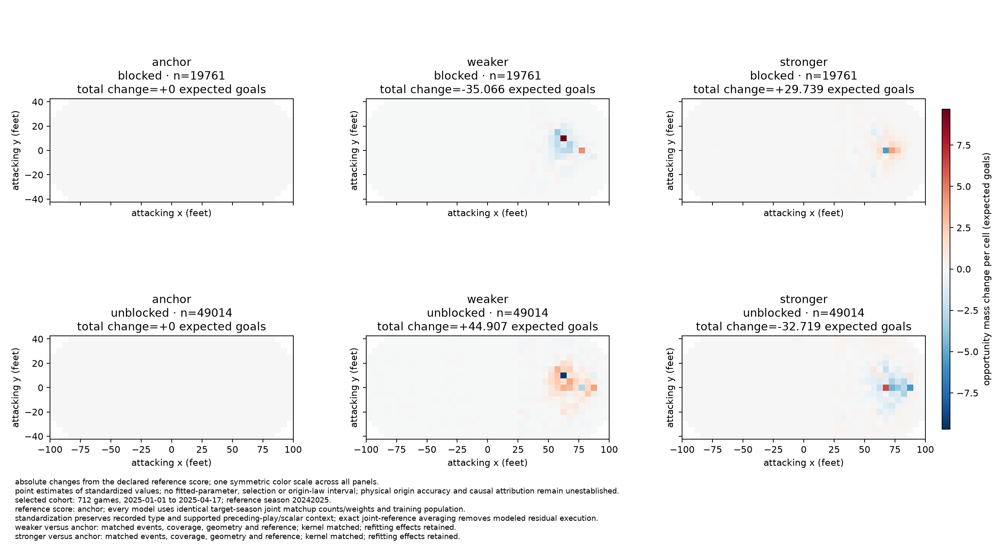
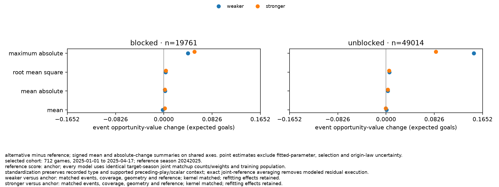

# chance-2 scientific decision

decision: **`withheld`**. every numerically eligible development recipe has a decisive applicable all-attempt goal-calibration failure under the declared development filter. no primary survives. transfer, kernel variants and final fits are not run; no handoff index is issued. 04 and publication remain unauthorized. [03b's rejection](../chance-03b/decision.md) remains unchanged.

this completes the bounded [03e study](../../specs/03e-training-assessment.md) through its no-surviving-primary stop condition. neither resources nor map differences caused withholding; criteria, cutoffs and numerical tolerances remain unchanged.

## study and numerical dispositions

all three seasons were already research-exposed. chronological whole-game checks are fit-held-out retrospective evidence, not untouched confirmation. the [protocol](protocol.md) identifies selections, configurations, source audits and practical budgets; [verification](verification.md) records software/numerical checks, resources and independent reviews.

| population | dates / seasons | selected games | eligible attempts / unblocked / goals |
| --- | --- | ---: | ---: |
| development training | 2023-10-10–2024-12-31; all 2023–24 and first 600 games of 2024–25 | 1,912 | 181,147 / 128,679 / 7,614 |
| development assessment and scoring | 2025-01-01–2025-04-17; remaining 2024–25 | 712 | 68,775 / 49,014 / 2,804 |
| planned transfer assessment | 2025-10-07–2026-04-16; all 2025–26 | 1,312 | not assessed |

all selected development games were reconstructed; one training game contributes no eligible attempt. assessment's 85,317 recognized attempts partition into 68,775 valued, 16,270 outside scope and 272 unavailable; recognized goals partition into 2,804 eligible, 1,512 outside and 46 unavailable. reasons overlap, dispositions do not. source/identity errors were absent; the old fixture exclusions were removed. excluded populations receive no probability claim.

all three complete fits/evaluations/scores share one definitive bundle. anchor fitting used clean `e20adb2`; other fitting and every compared evaluation/score/review used clean `5bb2897`. inner solves stopped on `ftol`; no unreported `gtol` attainment or global optimum is claimed.

| recipe | native starts: uniform / unblocked-multinomial | chosen start | held-out mean observed-record negative log likelihood | development disposition |
| --- | --- | --- | ---: | --- |
| anchor | converged 1,853 / converged 1,751 | `uniform` | 5.6536768379091695 | numerical candidate; calibration failure |
| weaker | converged 1,431 / converged 1,556 | `unblocked_multinomial` | 5.653159100298186 | numerical candidate; calibration failure |
| stronger | iteration limit 2,000 / converged 1,988 | `unblocked_multinomial` | 5.6584543667771285 | numerical candidate; calibration failure |

stronger's converged second start supplies the candidate; its failed start remains visible. weaker's original fit-process exit was unobserved; retained completion evidence is documented in verification.

both frozen goal benchmark labels are **`stronger`**, selected independently by each recipe's own benchmark development log loss: conversion 0.1897453406562429 and all-attempt 0.16189285043324317, strict minima without ties. comparator selection does not designate a primary; marginal unblocked has no comparator. **`anchor` is the prospectively fixed diagnostic score reference**, not a primary, admission fallback or rescue candidate.

## decisive probability evidence

the represented fixed all-attempt probability bin **[0.10, 0.15)** is consequential for every recipe through its share of the whole quantity's predicted goal mass. the declared trigger is at least 5% of attempts **or** predicted positive mass. bin membership is predictor-specific and does not select on observed goals or unblocked status.

| recipe | bin attempts / goals / contributing games | predicted goals | attempt share / predicted-goal-mass share |
| --- | ---: | ---: | ---: |
| anchor | 2,089 / 201 / 663 | 251.991067 | 3.037441% / 8.557944% |
| weaker | 2,340 / 216 / 670 | 279.321001 | 3.402399% / 9.494915% |
| stronger | 1,956 / 199 / 664 | 240.307888 | 2.844057% / 8.161207% |

errors and 95% intervals below are predicted-minus-observed **percentage points**, printed to six decimals; the consequential goal margin is **±1.0 percentage point**. linked native evidence retains full precision.

| recipe | error | whole-game interval | seven-day interval | fourteen-day interval | result: game / seven / fourteen |
| --- | ---: | --- | --- | --- | --- |
| anchor | +2.440932 | [1.130896, 3.696298] | [1.208285, 3.458282] | [1.460163, 3.408421] | failure / failure / failure |
| weaker | +2.706026 | [1.445290, 3.943003] | [1.831613, 3.492479] | [2.003545, 3.282187] | failure / failure / failure |
| stronger | +2.111855 | [0.763037, 3.466075] | [1.131892, 3.029867] | [1.185078, 3.008134] | insufficient / failure / failure |

all three declared methods apply; favorable blocking cannot be selected after inspection. stronger's game interval overlaps the margin, but both calendar intervals lie wholly above it. every row has mixed labels and zero undefined draws. calendar rows retain 15 contributing of 16 selected seven-day blocks and 8 of 8 fourteen-day blocks, with empty calendar support and final partial blocks retained. the 100-game support minimum is not a rejection floor.

| claim / criterion | result | consequence |
| --- | --- | --- |
| minimum record likelihood among converged recipes without decisive applicable calibration failure | no survivor | no primary; stop dependent stages |
| overall goal calibration, both quantities: ±0.25 percentage point | every recipe's game/seven/fourteen interval overlaps a boundary | insufficient support, not decisive development rejection |
| overall marginal-unblocked calibration: ±1 percentage point | all recipes supported under all methods | does not waive goal failure |
| paired proper losses against frozen stronger benchmarks | unresolved comparisons, weaker inferiority and limited stronger no-excess support | diagnostic; does not rescue calibration or prove universal equivalence |

anchor's log-loss/brier comparisons remain unresolved for both quantities under every method. weaker's conversion log loss is inferior under all methods; all-attempt log loss is inferior under games and unresolved under calendar blocks; both brier comparisons remain unresolved. stronger's conversion comparisons remain unresolved; all-attempt brier shows no excess under all methods, while all-attempt log loss shows no excess only under fourteen-day blocks. proper losses are development diagnostics, not an added selection gate. small-group precision insufficiency alone would permit further assessment; the decisive bin failures do not.

intervals use 2,000 paired pooled draws, `PCG64`, seed `3032026`. they condition on fitted models/resampling assumptions, exclude fitting/model-selection/origin-law uncertainty and establish no simultaneous coverage. calendar blocks are dependence sensitivities, not certified independent horizons. this conservative project decision establishes neither universal misspecification nor physical-origin error.

the three calibration figures show factual actor-state probabilities, twenty fixed bins, counts and **game** intervals; the calendar table above is essential. conversion conditions on unblocked outcome and quantized recorded-origin proxy. recorded-context goal/unblocked probabilities integrate the origin prior without focal location, outcome or posterior. type/eligibility remain retrospective measurements. full ranges retain all points/intervals; the common ±0.02 zoom is display-only. hollow points retain support limitations. all seasons were research-exposed.

## retained opportunity and measurement diagnostics

matched scores share events, source/selection identities, training population, 656-cell grid and **20242025 target joint matchup counts/weights**. recorded type and supported prior-play/scalar context remain; exact joint averaging standardizes modeled residual execution. opportunity values differ from factual-actor assessment probabilities. positive block opportunity is not goal probability conditional on a known block. 19,761 blocked distributions retain full support; 49,014 unblocked locations remain recorded proxies.

weaker/stronger compare with diagnostic anchor. event/spatial mass conserve; original-type/role strata and attributable extremes remain in the bundle. changes confound bundled penalties and refitting.

| recipe / population | signed total change, expected goals | mean / maximum absolute event change | spatial absolute mass change / anchor mass | spatial shape total variation | blocked posterior mean / maximum total variation |
| --- | ---: | ---: | ---: | ---: | ---: |
| weaker / blocked | −35.065708 | 0.001919 / 0.041022 | 69.816251 / 16.386% | 0.074410 | 0.120093 / 0.685968 |
| weaker / unblocked | +44.907293 | 0.002871 / 0.150203 | 107.880712 / 4.384% | 0.019157 | not applicable: recorded proxy |
| stronger / blocked | +29.739088 | 0.001580 / 0.052438 | 53.126391 / 12.469% | 0.060776 | 0.072026 / 0.347910 |
| stronger / unblocked | −32.718544 | 0.002854 / 0.085140 | 103.631724 / 4.211% | 0.017219 | not applicable: recorded proxy |

blocked signed-total magnitudes exceed 5% of anchor mass (8.230%/6.980%), spatial changes exceed 10%, and both unblocked mean absolute changes exceed 0.0025. these would require player robustness for an admitted family. event maxima are located at `2024020925/321`, `2024020633/15` (weaker blocked/unblocked) and `2024021256/253`, `2024021295/337` (stronger); posterior maxima have separate native locators.

absolute maps share one scale across models/populations; signed changes share one symmetric scale. **anchor is only the fixed diagnostic reference.** all figures cover the same 712 already research-exposed games and 20242025 target joint reference. map/event summaries have no fitting, selection or origin-law uncertainty intervals; physical-origin accuracy and causal attribution remain unestablished.

the **20242025 tip ledger** separates recognized and valued populations. opportunity is missing for outside/unavailable records, not imputed to zero. totals sum the saved tip-specific 656-cell spatial masses; their distributions remain in the bundle.

| original type / status | recognized attempts / goals | valued attempts / goals | outside / unavailable; missing opportunity | opportunity: anchor / weaker / stronger, expected goals |
| --- | ---: | ---: | ---: | ---: |
| `deflected` / blocked | 83 / 0 | 71 / 0 | 12 / 0; 12 | 2.462232 / 2.193418 / 3.023224 |
| `deflected` / unblocked | 1,038 / 96 | 838 / 65 | 195 / 5; 200 | 67.571503 / 67.618745 / 67.725887 |
| `tip-in` / blocked | 511 / 0 | 442 / 0 | 69 / 0; 69 | 16.392275 / 14.750641 / 19.376859 |
| `tip-in` / unblocked | 5,498 / 418 | 4,412 / 287 | 1,076 / 10; 1,086 | 330.692644 / 327.984888 / 335.485373 |

the 5,250 eligible unblocked tips partition into `0_10`, `10_20`, `20_40`, `40_plus`: 1,584/147, 2,257/150, 1,099/52 and 310/3 attempts/goals. fourteen proxies are below the goal line, including one goal; 5,236/351 are not. distance uses original coordinates before quantization; these groups assess **only conversion**. every consequential tip group's support is insufficient under all methods. distant tips are not automatically errors; block contacts are not tip-location proxies. neither the ledger nor kernel stability brackets proxy error. affected player conclusions would require justified location sensitivity or withholding.

## source, omissions and shared-law limits

three complete 1,312-game source audits retain exclusions, goals, context failures, original types, locators and unresolved exposure. no raw correction or blanket relabeling was made. eligible wrist counts fall 74,641→65,802→56,427 while snaps rise 16,894→26,004→30,789; hockey/player composition and recording change remain inseparable. [type drift](../../issues/recorded-shot-type-drift.md) and [shot-location evidence](../../issues/shot-location-evidence.md) retain these limits.

saved [residuals](/Users/nnandal/Documents/code/hockey-stats-03e-runs/review-notes/development-residuals.json) show greater away than home goal overprediction, recent-context conversion overprediction (0.844–0.881 percentage point) versus slight underprediction for `none`, positive tip-in/negative slap conversion residuals, and greater january goal overprediction. score-stratified marginal-unblocked residuals change sign; last-minute marginal-unblocked residuals span −1.973 to −1.803 percentage points. time diagnostics add no gate and identify no causal mechanism.

| omission | judgment / owner |
| --- | --- |
| prior action / sequence | immediate ordered records within five seconds are reset-aware proxies, not possession or puck trajectories; no sequence feature is justified here |
| shift age / exposure | 6,341 eligible assessment events lack compatible interval links; 241,942 elapsed seconds remain unresolved. retain probability evidence without inventing exposure. 04 owns compatible populations and uniquely attributable shift age; [source integrity](../../issues/shift-source-integrity.md) remains open |
| handedness | fresh reports know hands for 1,022/1,041, 1,023/1,041 and 1,037/1,063 roster ids, not eligible-weighted coverage or historical availability dates. current hands are not thereby proved wrong or unusable retrospectively; [bio dating](../../issues/historical-bio-dating.md) requires supported interpretation or explicit limits |
| temporal pooling | player/season effects shrink toward zero with adjacent-season change penalties; no within-season recency state. 04 owns selected-season ability and historical-use cutoffs; all-season fitting cannot manufacture earlier forecasts |

the declared kernel range is a stress experiment, not contact physics: distance 10/20/40 implies uniform-grid average displacements 16.12/31.21/46.74 feet; direction 2/4/8 at distance 20 implies goalward cosines 0.767/0.892/0.947. finite-rink truncation makes them origin-dependent. shared conditional-law dissent remains substantive: at `(77.5, 0)`, anchor assigns 0.46337 contact mass beyond the goal plane and 0.17104 to planar rays crossing between the posts before contact; variants retain aperture-crossing mass 0.10820–0.23565. the family does not bracket goal-aware stopping geometry.

predevelopment judgment allowed conditional research without physical-accuracy claims. unconditional past-line contact observations cannot validate or refute the origin-conditional law; release geometry, height, deviations and recording error remain unobserved. [the kernel issue](../../issues/block-kernel-goal-geometry.md) requires broader justified sensitivity or withholding affected **blocked and unblocked** player conclusions before publication. no new physical gate was added. declared budgets and league stability cannot establish player magnitudes, signs or spatial robustness.

## complete family disposition and evidence

| planned member | development | transfer fit / assessment | conditional final fit / score |
| --- | --- | --- | --- |
| anchor, distance 20 / direction 4 | complete fit/evaluation/score; calibration failure | not run: no development primary | not run: no admission |
| weaker, penalties ×0.5 | complete fit/evaluation/score; calibration failure | not run: no development primary | not run: no admission |
| stronger, penalties ×2 | complete fit/evaluation/score; calibration failure | not run: no development primary | not run: no admission |
| primary distance 10 / direction 4 | defined only after primary selection | not run: no primary to vary | not run: no admission |
| primary distance 40 / direction 4 | defined only after primary selection | not run: no primary to vary | not run: no admission |
| primary distance 20 / direction 2 | defined only after primary selection | not run: no primary to vary | not run: no admission |
| primary distance 20 / direction 8 | defined only after primary selection | not run: no primary to vary | not run: no admission |

these are dependent-stage nonexecutions, not transfer rejections or silently omitted alternatives. there is no pretransfer family freeze, final 2025–26 artifact or `handoff.json`. reopening models or criteria requires a disclosed new round.

the [definitive native comparison](/Users/nnandal/Documents/code/hockey-stats-03e-runs/reviews/development-5bb2897/comparison.json), sha256 `67c08b0bb551a5312297998ccc3647906edac80216ccbfae0fe5abdcb8630f7c`, binds all three assessments/scores and [schema-2 evidence](/Users/nnandal/Documents/code/hockey-stats-03e-runs/inputs/development-evidence.json). [saved criteria](/Users/nnandal/Documents/code/hockey-stats-03e-runs/reviews/development-criteria.md) and [full-precision annotations](/Users/nnandal/Documents/code/hockey-stats-03e-runs/reviews/development-criteria.json) preserve every overall/bin/subgroup result, absent/constant-label limitation, method and proper-loss comparison. native `scientific_assessment: not_performed` remains unchanged; this written decision owns withholding.

the immutable [development protocol snapshot](/Users/nnandal/Documents/code/hockey-stats-03e-runs/inputs/protocol-development.md), 32,670 bytes, sha256 `c6590704d0dda034ef9ab2c83f2b9dc7c60fb44d7bec205a867681900c81dac4`, predates scoring and binds the diagnostic comparison; it is not a transfer freeze. independent [criterion audit](/Users/nnandal/Documents/code/hockey-stats-03e-runs/review-notes/development-comparison-criteria-review.json), [scientific challenge](/Users/nnandal/Documents/code/hockey-stats-03e-runs/review-notes/development-scientific-challenge.json) and [visual review](/Users/nnandal/Documents/code/hockey-stats-03e-runs/review-notes/development-figure-review.json) support the facts and qualifications. all six embedded PNGs preserve exact native bytes. complete fits/checkpoints and source fixtures remain preserved; temporary software checks were deleted as recorded in [verification](verification.md).
