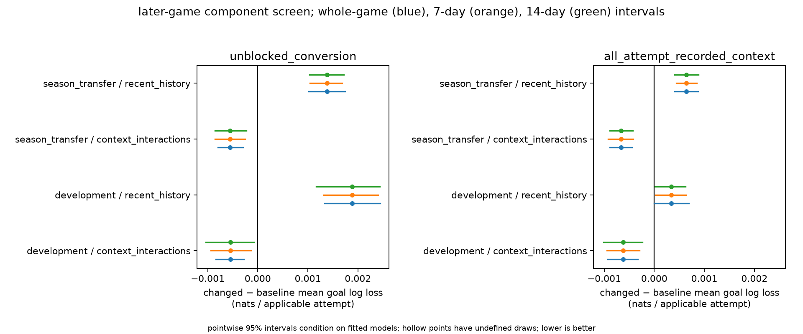
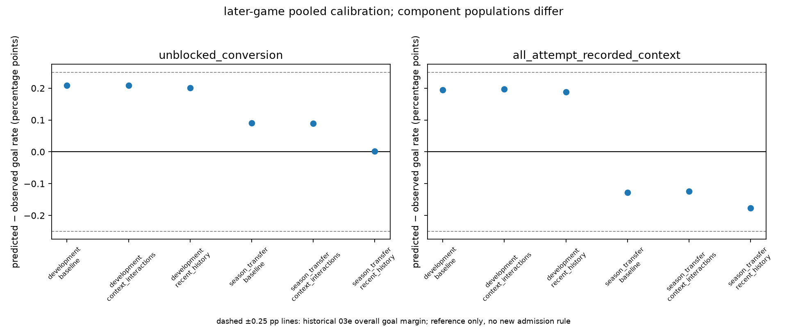
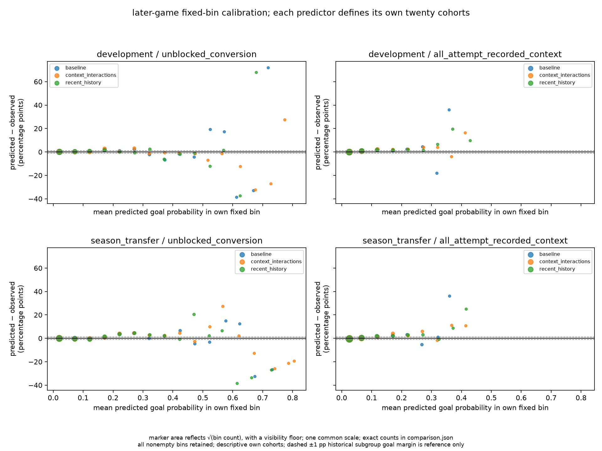

# chance-component development decision

recommend the fixed recent-context interactions for further research in each observable component. retain the full declared training history. interactions improve pooled goal log loss in both windows; removing the oldest season worsens it in both. this completes 03f's developmental screen. it admits no model, issues no handoff and does not authorize 03g, 04 or publication. 03b remains rejected and 03e remains withheld.

the question was whether differentiated preceding-event context or shorter history improves recorded-outcome probabilities. [protocol](protocol.md), [saved diagnosis](diagnosis.md) and [verification](verification.md) define the inputs, measurement limits and software evidence. all three seasons were already research-exposed. the authoritative [comparison](/Users/nnandal/Documents/code/hockey-stats-03f-runs/comparisons/screen/comparison.json), sha256 `295a405da1d94efb16894209154b1801e8ca331d543fe374d12814c3191bf0c4`, retains full-precision sums, all twenty own bins, named groups, baseline-defined actor-support comparisons and resource records.

| window | baseline / interaction training | history-ablation training | later assessment |
|---|---|---|---|
| development | complete 2023–24 plus 600 pre-january 2024–25 games; 1,912 games | those same 600 games only | remaining 712 games of 2024–25 |
| season transfer | complete 2023–24 and 2024–25; 2,624 games | complete 2024–25; 1,312 games | complete 2025–26; 1,312 games |

conversion conditions on eligible unblocked attempts and recorded-proxy geometry. direct all-attempt probability predicts recorded goals from context and actors, without focal coordinates or the block outcome. their populations and losses differ; there is no combined score. the development baselines exactly reuse anchor's saved conversion stage and direct benchmark, not its composed all-attempt probability. ten independent component solves converged under the unchanged anchor configuration; no joint em ran.

| window | quantity | recipe | status | applicable attempts | mean log loss | brier | predicted − observed, pp |
|---|---|---|---|---:|---:|---:|---:|
| development | conversion | baseline | reused | 49,014 | 0.1899123653 | 0.0499713574 | +0.208873 |
| development | direct all-attempt | baseline | reused | 68,775 | 0.1620775121 | 0.0383391715 | +0.194070 |
| development | conversion | context interactions | fitted | 49,014 | 0.1893679926 | 0.0498379996 | +0.208616 |
| development | direct all-attempt | context interactions | fitted | 68,775 | 0.1614572231 | 0.0382659536 | +0.196691 |
| development | conversion | recent history | fitted | 49,014 | 0.1917953704 | 0.0502191920 | +0.200759 |
| development | direct all-attempt | recent history | fitted | 68,775 | 0.1624152308 | 0.0383700716 | +0.188521 |
| season transfer | conversion | baseline | fitted | 87,018 | 0.2002701259 | 0.0533064836 | +0.090748 |
| season transfer | direct all-attempt | baseline | fitted | 120,532 | 0.1725059608 | 0.0412251994 | −0.127680 |
| season transfer | conversion | context interactions | fitted | 87,018 | 0.1997191868 | 0.0532348863 | +0.089200 |
| season transfer | direct all-attempt | context interactions | fitted | 120,532 | 0.1718410677 | 0.0411785724 | −0.123505 |
| season transfer | conversion | recent history | fitted | 87,018 | 0.2016560210 | 0.0535333233 | +0.001595 |
| season transfer | direct all-attempt | recent history | fitted | 120,532 | 0.1731483061 | 0.0412842905 | −0.176983 |

observed goals are 2,804 in development and 5,291 in season transfer for either applicable population. log loss is in nats per applicable attempt; pp means percentage points. table values are rounded. the exact paired point deltas below use `changed − baseline`; negative is improvement. direction labels describe point estimates, not demonstrated universal superiority.

| recipe | quantity | development delta | season-transfer delta | frozen label |
|---|---|---:|---:|---|
| context interactions | conversion | −0.0005443727402023932 | −0.0005509390946755157 | `consistent_direction` |
| context interactions | direct all-attempt | −0.0006202889994314585 | −0.0006648930239678174 | `consistent_direction` |
| recent history | conversion | +0.0018830051419229028 | +0.0013858950441744127 | `no_improvement` |
| recent history | direct all-attempt | +0.00033771870812678814 | +0.000642345352411066 | `no_improvement` |

| window / recipe / quantity | whole-game 95% loss interval | seven-day interval | fourteen-day interval |
|---|---|---|---|
| development / interactions / conversion | [−0.0008404845, −0.0002757081] | [−0.0009388637, −0.0001357967] | [−0.0010383921, −0.0000764293] |
| development / interactions / direct all-attempt | [−0.0009260219, −0.0003260626] | [−0.0009444350, −0.0002951081] | [−0.0010123297, −0.0002373511] |
| development / recent history / conversion | [+0.0013369538, +0.0024474684] | [+0.0013203889, +0.0024054687] | [+0.0011663385, +0.0024335728] |
| development / recent history / direct all-attempt | [−0.0000062210, +0.0006892392] | [+0.0000204985, +0.0006338892] | [+0.0000146699, +0.0006259371] |
| season transfer / interactions / conversion | [−0.0008004082, −0.0002963455] | [−0.0008516114, −0.0002496220] | [−0.0008548255, −0.0002319460] |
| season transfer / interactions / direct all-attempt | [−0.0008884358, −0.0004422524] | [−0.0009232418, −0.0004184747] | [−0.0008842537, −0.0004292310] |
| season transfer / recent history / conversion | [+0.0010159799, +0.0017416723] | [+0.0010421537, +0.0016882026] | [+0.0010361344, +0.0017184579] |
| season transfer / recent history / direct all-attempt | [+0.0004023725, +0.0008756625] | [+0.0004384777, +0.0008494940] | [+0.0004082282, +0.0008784359] |

each interval uses 2,000 paired `PCG64` draws, seed `3032026`, pooled sums/counts and linear percentiles. development has 712 contributing games, 15/16 contributing/selected seven-day blocks and 8/8 fourteen-day blocks. season transfer has 1,312 games, 26/28 seven-day blocks and 13/14 fourteen-day blocks. empty units and final partial blocks remain; no real draw was undefined. intervals are pointwise and conditional on fitted models, omitting fit/model-selection uncertainty. calendar horizons are sensitivity checks, not proof of adequate dependence modeling. development's direct history whole-game interval overlaps zero; this is neither equivalence nor a reason to replace it with the calendar intervals.

the interaction gains are modest and consistent. pooled brier point estimates improve in every window/component; the season-transfer conversion fourteen-day brier interval still overlaps zero. pooled calibration barely changes. the development direct residual slightly worsens, from +0.194070 to +0.196691 pp; transfer moves slightly toward zero. history ablation brings transfer conversion's pooled residual almost to zero while worsening both proper losses. pooled calibration alone is therefore a poor selection criterion here.

adverse named-group results remain. interaction conversion brier worsens for defenders in both windows, and conversion log loss worsens for baseline-defined unseen shooters in both. development direct takeaway residual rises from +3.804372 to +4.196633 pp on the same 823 attempts; conversion takeaway residual rises from +4.537395 to +4.816938 pp on 601 attempts. the development direct interaction's own `[0.10,0.15)` bin has 1,888 attempts and +2.368062 pp residual. own-bin memberships differ across predictors, so this is a descriptive calibration discrepancy, not a paired loss cohort. these named-group summaries have no new clustered subgroup intervals or admission thresholds. lower pooled loss has not repaired all conditional errors.

the saved joint-model diagnosis finds recent-context and january excess shared by historical direct benchmarks, with some different in-sample discrepancies. this supports testing differentiated context, not a unique causal explanation. removing history changes sample size, annual pooling and actor support together; its failure does not prove that every older season helps. the fixed interaction terms describe an immediate preceding event, not sustained possession or a shot sequence. the two quantities remain separate research recommendations; the screen has not assessed their joint integration or any opportunity value.

| next claim | evidence needed before that claim |
|---|---|
| recorded-outcome probability improvement | 03g must specify the selected component/joint revision, preserve chronology and unavailable rows, and prospectively justify applicable calibration/proper-loss checks; retain adverse context and actor groups |
| physical shooting origins | independently informative origin evidence and source/measurement validation; proxy-coordinate or direct-benchmark gains do not establish this |
| standardized opportunity stability | justified origin/execution sensitivity after coherent joint probability assessment; these component losses are not opportunity-value measurements |
| player attribution | compatible exposure plus player magnitude/sign/spatial robustness under the justified model family; this remains 04's separate responsibility |

sustained-sequence and shift-age feasibility remains limited by existing source links and unresolved reconstruction. membership at two events cannot establish continuous presence. rest, workload and shift age remain distinct; omitted handedness/rink/coaching/setter/tip/block concepts retain [input-audit](../model-input-audit.md) and existing issue ownership. no acquisition, new source feature, latent-origin revision, joint fit, final fit or publication occurred. a later admission rule must be justified before its assessment; none is selected here to pass these results.
