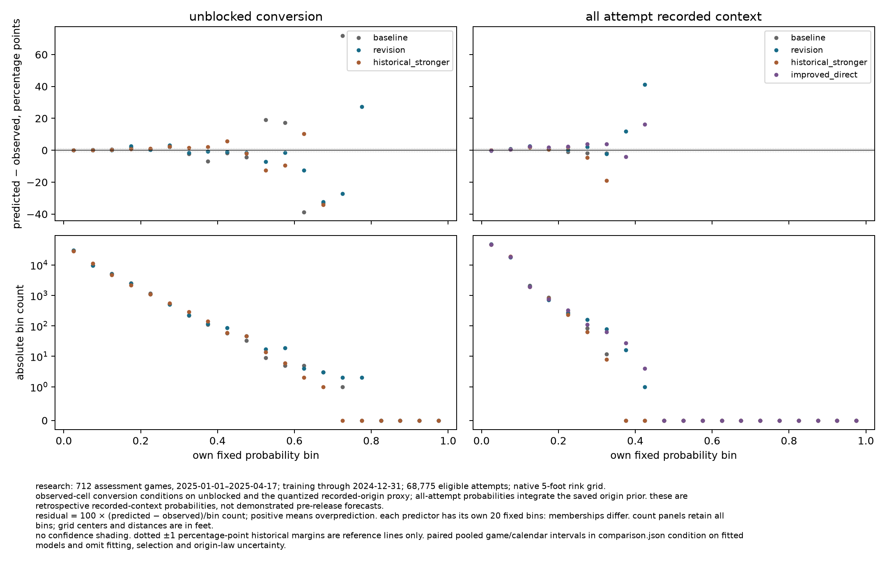
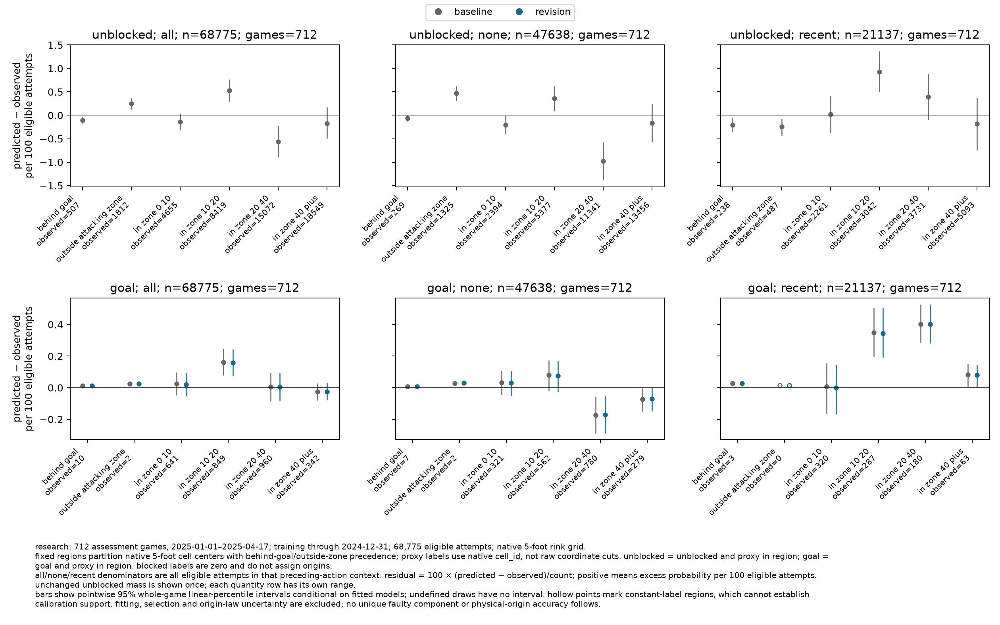
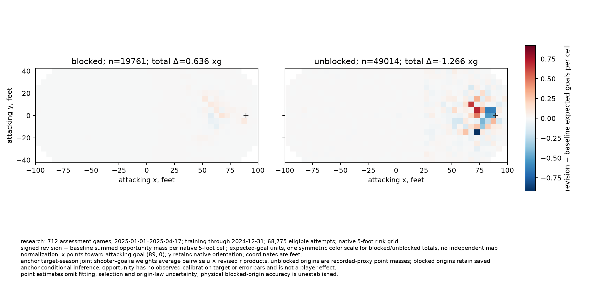

# saved conversion integration decision

recommend `assess_integrated` in a separately specified 03h assessment. the saved conversion gain survives composition, but calibration and observable spatial discrepancies remain. this warrants assessing a coherent candidate, not admitting it or starting another fit campaign. known defects may withhold it. 03b remains rejected; 03e remains withheld. 03h, 04 and publication remain unauthorized.

this completes the three questions in the [specification](../../specs/03g-chance-assessment.md) under the frozen [protocol](protocol.md). [verification](verification.md) records independent software, arithmetic and content review. the authoritative [comparison](/Users/nnandal/Documents/code/hockey-stats-03g-runs/diagnosis/comparison.json), sha256 `e2d825297f5dd5a02871595a101d4a458a1c0546742f1acb9c8068a9f51e5e3c`, retains all own bins, groups, per-game sums, intervals and cell arrays; [completion](/Users/nnandal/Documents/code/hockey-stats-03g-runs/diagnosis/completion.json) binds its inputs and outputs.

training remains 1,912 games through 2024-12-31. assessment is the original 712 later, disjoint 2024–25 games, 2025-01-01–2025-04-17: 85,317 recognized attempts, 68,775 eligible, 16,270 outside scope and 272 unavailable. eligible outcomes comprise 49,014 unblocked attempts, 19,761 blocks and 2,804 goals. these seasons were already research-exposed. retain anchor origin, avoidance, kernel and joint actor reference; replace the complete saved conversion stage. no fitting, acquisition, changed eligibility or player attribution occurred.

## composed factual probabilities

the revision improves both proper losses in observed-cell conversion and composed all-attempt goals. pooled calibration barely moves. historical `stronger` supplies its direct benchmarks; `improved_direct` is the saved standalone interaction comparator. their maps and opportunity values are not compared.

| quantity / predictor | attempts | observed goals | predicted goal sum | mean log loss | brier | predicted − observed, pp |
|---|---:|---:|---:|---:|---:|---:|
| conversion / baseline | 49,014 | 2,804 | 2,906.377 | 0.1899123653 | 0.0499713574 | +0.208873 |
| conversion / revision | 49,014 | 2,804 | 2,906.251 | 0.1893679926 | 0.0498379996 | +0.208616 |
| conversion / historical stronger | 49,014 | 2,804 | 2,918.953 | 0.1897453407 | 0.0500132909 | +0.234532 |
| all-attempt / baseline | 68,775 | 2,804 | 2,944.528 | 0.1618297700 | 0.0382929443 | +0.204330 |
| all-attempt / revision | 68,775 | 2,804 | 2,939.730 | 0.1613819527 | 0.0382152009 | +0.197354 |
| all-attempt / historical stronger | 68,775 | 2,804 | 2,940.529 | 0.1618928504 | 0.0383088627 | +0.198516 |
| all-attempt / improved direct | 68,775 | 2,804 | 2,939.275 | 0.1614572231 | 0.0382659536 | +0.196691 |

conversion conditions on the quantized unblocked recorded proxy. all-attempt probability integrates the origin prior without focal location/block outcome. these are retrospective recorded-context probabilities, not demonstrated pre-release forecasts. log loss is nats per applicable attempt; pp means percentage points. values are rounded.

| revision − baseline | point delta | whole-game 95% interval | seven-day interval | fourteen-day interval |
|---|---:|---|---|---|
| conversion log loss | −0.000544373 | [−0.000840484, −0.000275708] | [−0.000938864, −0.000135797] | [−0.001038392, −0.000076429] |
| conversion brier | −0.000133358 | [−0.000209981, −0.000063615] | [−0.000235235, −0.000031842] | [−0.000261250, −0.000000060] |
| all-attempt log loss | −0.000447817 | [−0.000648907, −0.000267391] | [−0.000682991, −0.000208349] | [−0.000717544, −0.000192566] |
| all-attempt brier | −0.000077743 | [−0.000114687, −0.000044082] | [−0.000116174, −0.000037974] | [−0.000124487, −0.000031884] |

all four deltas have negative intervals under all three schemes; conversion's fourteen-day brier endpoint is barely below zero. use 2,000 paired `PCG64` draws, seed `3032026`, pooled additive sums/counts and linear percentiles. there are 712 contributing games, 15/16 contributing/selected seven-day blocks and 8/8 fourteen-day blocks. empty units/final partial blocks remain; no draw was undefined. intervals are pointwise and conditional on saved fits, excluding fitting, selection and origin-law uncertainty. the revision's lower point losses than improved direct are not a demonstrated superiority claim between those two predictors.

the anchor-defined all-attempt `[0.10,0.15)` cohort contains the same 2,089 attempts and 201 goals throughout. baseline/revision predicted sums are 251.991/250.274: residual +2.440932/+2.358722 pp. its log loss improves 0.319708→0.316119 without removing overprediction. revision's own bin instead contains 1,999 attempts and 192 goals, with +2.507250 pp residual; it cannot replace the paired cohort. the conversion subset of that anchor cohort has 1,662 attempts/201 goals and residual +2.468587→+2.569598 pp. revised own conversion bins `[0.15,0.20)` and `[0.25,0.30)` retain +2.7301/+3.1724 pp on 2,465/510 attempts.

adverse named groups remain: all-attempt giveaway log loss rises +0.000454005 on 3,216 attempts, and its residual rises +2.570763→+2.594935 pp. takeaway residual rises +3.407126→+3.609222 pp on 823 attempts despite better proper losses. january brier worsens +0.000004743 on 21,827 attempts; defender brier worsens +0.000016245 on 24,523. conversion unseen-shooter log loss worsens +0.000174296 on 843 anchor-defined attempts, and no-recent conversion slightly worsens both proper losses on 34,162. full named-group evidence remains in the comparison; these are descriptive checks without new subgroup intervals or admission thresholds.

marginal unblocked probability is exactly unchanged: 48,883.742 predicted against 49,014 observed on 68,775 attempts, residual −0.189397 pp, log loss 0.572249681 and brier 0.194428339.

## observable spatial disagreement

regions partition native five-foot cell centers. observed labels use the quantized unblocked proxy; blocked labels are zero. every denominator below is all 68,775 eligible attempts, rather than attempts observed in that region. unchanged `A_R` predicts unblocked and proxy in region; `G_R` predicts goal and proxy in region.

| native region | observed unblocked | unchanged `A_R` sum | observed goals | baseline `G_R` sum | revised `G_R` sum |
|---|---:|---:|---:|---:|---:|
| behind goal | 507 | 434.759 | 10 | 19.125 | 18.927 |
| outside attacking zone | 1,812 | 1,984.085 | 2 | 19.129 | 19.369 |
| in zone, 0–10 ft | 4,655 | 4,560.400 | 641 | 658.489 | 655.000 |
| in zone, 10–20 ft | 8,419 | 8,784.669 | 849 | 960.322 | 958.257 |
| in zone, 20–40 ft | 15,072 | 14,687.390 | 960 | 962.903 | 962.887 |
| in zone, 40+ ft | 18,549 | 18,432.440 | 342 | 324.561 | 325.291 |

context resolves substantial cancellation. no-recent/recent denominators are 47,638/21,137, each supported by 712 games. unchanged unblocked mass in 10–20 ft has recent residual +0.924972 per 100 eligible attempts, whole-game interval [+0.496610,+1.368014]. no-recent 20–40 ft is −0.981744 [−1.387244,−0.574153]. outside-zone unblocked residual reverses from +0.469447 without recent context to −0.243888 with it.

revised goal mass retains recent excess in 10–20 ft, +0.345267 [+0.191051,+0.505396], and 20–40 ft, +0.400877 [+0.282445,+0.526517]. no-recent 20–40 ft instead has deficit −0.171810 [−0.288664,−0.054029]. recent outside-zone goals have zero positives: the hollow point and conditional residual interval cannot establish calibration support. these observable compound discrepancies cannot uniquely blame origin, avoidance or kernel, or establish blocked-origin accuracy. conversion-only changes cannot repair unchanged `A_R`.

## standardized opportunity

retain the anchor's 2024–25 joint shooter–goalie weights and exact pairwise probability products. unblocked origins are recorded-proxy point masses; blocked posterior weights are exactly unchanged. expected-goal units are common across populations and maps.

| population | attempts | baseline total | revised total | signed change | mean absolute event change | maximum absolute event change |
|---|---:|---:|---:|---:|---:|---:|
| blocked | 19,761 | 426.081719 | 426.717263 | +0.635544 | 0.001418806 | 0.052624167 |
| unblocked | 49,014 | 2,460.990164 | 2,459.723682 | −1.266482 | 0.003146693 | 0.164749323 |

net changes are +0.149160%/−0.051462%; they conceal sum absolute event changes of 28.037/154.232 expected goals. small total changes do not establish negligible event or player changes.

| region | blocked signed mass change | unblocked signed mass change |
|---|---:|---:|
| behind goal | +0.002386 | −0.121213 |
| outside attacking zone | −0.006956 | −0.120786 |
| in zone, 0–10 ft | +0.146967 | −2.203349 |
| in zone, 10–20 ft | +0.177511 | +1.403691 |
| in zone, 20–40 ft | +0.162082 | −0.108147 |
| in zone, 40+ ft | +0.153554 | −0.116679 |

cell and regional arrays conserve event totals. maps retain native orientation and are not independently normalized. opportunity has no observed calibration target here, no error bars and no player-effect interpretation. physical origins and player sensitivity remain separate responsibilities.

## next decision and limits

`assess_integrated` means specify the candidate's supported model-conditional use, applicable probability/calibration/spatial checks and origin-law sensitivity before judging it in 03h. it must confront the known cohort and retained spatial defects, rather than repeat pooled loss calculations or rename this diagnosis. historical failures are not relaxed; the outcome can be withheld. no extra feature or expensive fit is mandatory.

context-dependent spatial misfit motivates structural research, but these results do not yet discriminate a sufficiently justified intervention among seasonal borrowing, origin/avoidance changes and other hypotheses. assessment avoids committing to a speculative fit campaign. the tradeoff is narrower immediate research breadth, with an explicit decision about what the coherent candidate can support. this is a recommendation, not 03h authorization or a 04 handoff. existing [probability](../../issues/all-attempt-probability.md), [conversion](../../issues/conversion-calibration.md), [spatial calibration](../../issues/observable-spatial-calibration.md) and [origin sensitivity](../../issues/origin-value-sensitivity.md) issues remain open.
