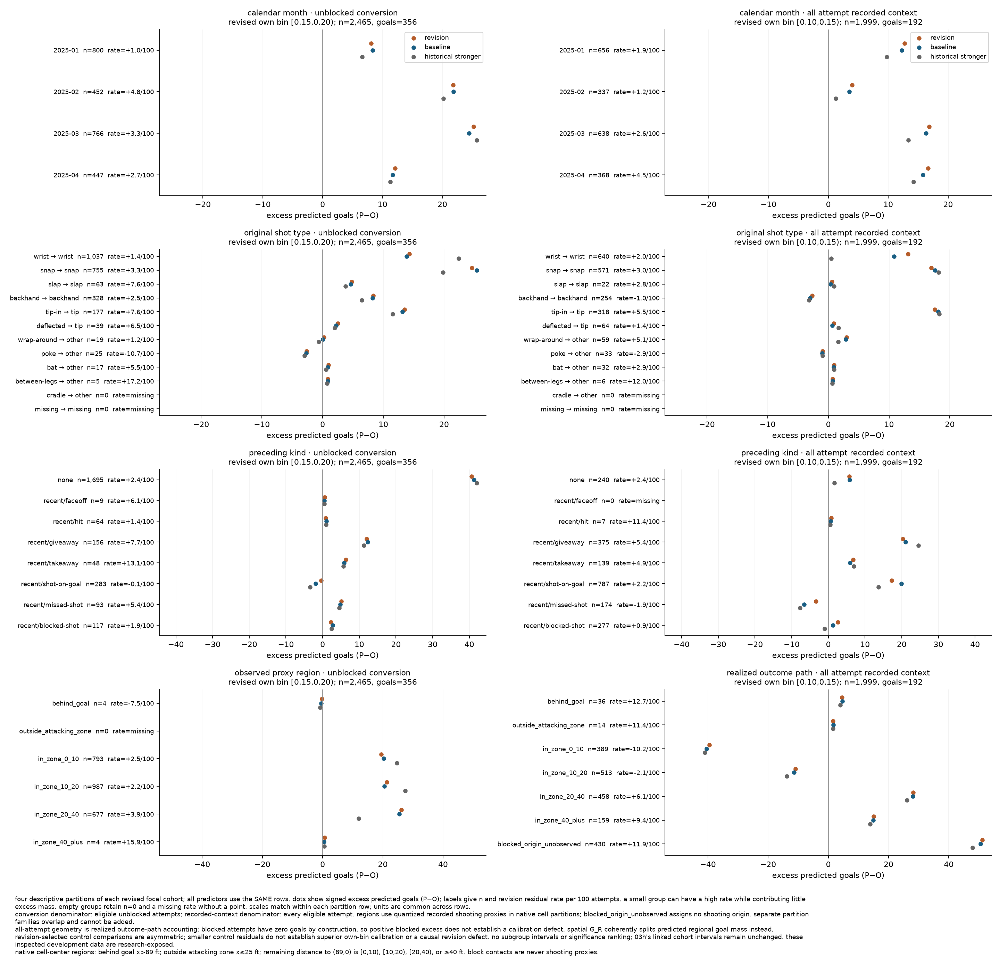
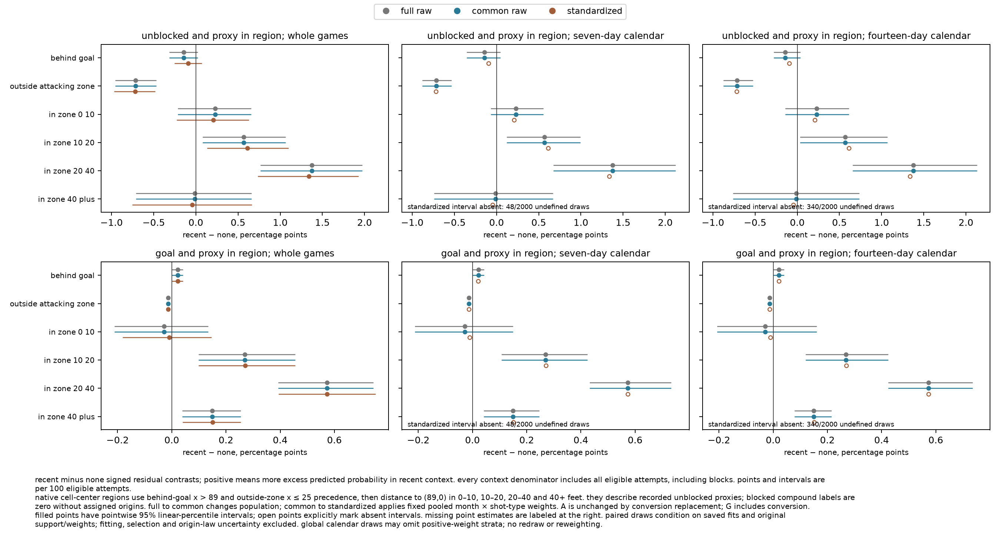

# saved localization and composition diagnosis

recommendation: **one avoidance-only interaction experiment**, separately specified in [03j](../../specs/03j-chance-experiment.md). the candidate remains **`withheld`**. new revised-bin localization finds broad overprediction; fixed month/type composition scarcely changes the main spatial discrepancies. this supports a constrained predictive test, not identification of an avoidance cause or admission. [protocol](protocol.md) · [verification](verification.md) · [complete tables](tables.md)

one saved pass retains all 712 games, 2025-01-01–2025-04-17: 85,317 recognized rows, 68,775 eligible attempts, 16,270 outside scope and 272 unavailable. eligible outcomes are 49,014 unblocked, 19,761 blocked and 2,804 goals. training ends 2024-12-31. these inspected development seasons remain research-exposed. no model was fitted, prepared or scored.

## what is new

03f described whole-population marginals; 03h established two required revised own-bin failures. 03i adds four exhaustive partitions of each revised failing cohort, with identical revision/baseline/`historical_stronger` memberships and per-game triples, plus a fixed month × model-type spatial comparison. the inherited bin intervals and verdict are reused, not reassessed.

| revised cohort | attempts / goals / games | predicted sum | excess goals | residual pp |
|---|---:|---:|---:|---:|
| conversion `[0.15,0.20)` | 2,465 / 356 / 691 | 423.296371 | +67.296371 | +2.730076 |
| all-attempt `[0.10,0.15)` | 1,999 / 192 / 656 | 242.119934 | +50.119934 | +2.507250 |

conversion's `none` group supplies +40.625 excess goals on 1,695 attempts: about 60% of net excess on 69% of attempts, at +2.397 pp, below the cohort's +2.730. its 770 recent attempts carry +26.671 at +3.464 pp. recent giveaway/takeaway rates are higher (+7.712/+13.102 pp), but their excesses are +12.031/+6.289 on 156/48 attempts. snap and wrist carry +24.549/+14.256 excess goals; tip-in carries +13.500 on 177 attempts. high rates and large excess mass are different observations.

the all-attempt cohort has 1,759 recent attempts (88% of membership) supplying +44.387 excess goals (89%); recent giveaways and shot-on-goal predecessors supply +20.309/+17.252. none/recent rates are similar (+2.389/+2.523 pp). mass shares largely follow cohort membership. both failures are broad across contexts, months and most major types; all-attempt backhand is an exception at −1.040 pp on 254 attempts. none-context rates are nearly identical between cohorts, and every month overpredicts. these descriptive rates have no new intervals and establish no context-specific remedy.

matched baseline/historical conversion residuals are +2.695/+2.587 pp; all-attempt residuals are +2.398/+1.930 pp. these controls share revised membership, so the comparison is asymmetric and does not establish their own-bin calibration or superiority. descriptive groups get no new intervals, rankings, cutoffs or exclusions. separate partition families overlap and cannot be added.

the horizontal axis shows excess goals; labels retain counts and revision residuals per 100 applicable attempts. quantized recorded-proxy regions use saved cell-center assignments. all-attempt geometry is realized outcome-path accounting: its 430 blocked attempts have zero goals and +51.184 predicted mass, mechanically, even under a correct outcome-blind predictor. that is not a block calibration failure. compound regional probabilities below supply the coherent spatial comparison without assigning blocked origins.

## measured composition supplies little relief

all 24 month × model-type strata have positive counts in both contexts. no attempts, positives or predicted mass are excluded; `full_raw` and `common_raw` are identical. none/recent denominators are 47,638/21,137 eligible attempts, each supported by 712 games. fixed pooled weights therefore change composition alone. every context/quantity/region keeps its own all-eligible denominator, including blocked zero labels.

rates and intervals are percentage points/per 100 eligible attempts. `A_R` is unblocked-and-proxy-in-region probability; `G_R` is goal-and-proxy-in-region probability. contrasts compare recent minus none within the SAME region. the two `A_R` foci were named before execution; `G_R` rows are their same-region companions. all six regions and absolute errors remain in [the tables](tables.md).

| quantity / region | raw contrast | standardized contrast; whole-game 95% interval | paired weighting shift; whole-game 95% interval |
|---|---:|---|---|
| `A_R`, 10–20 ft | +0.567783 | +0.610209 [+0.131057,+1.099610] | +0.042426 [−0.027929,+0.115576] |
| `A_R`, 20–40 ft | +1.374766 | +1.337744 [+0.732157,+1.926628] | −0.037023 [−0.111114,+0.034313] |
| `G_R`, 10–20 ft | +0.269114 | +0.270338 [+0.099077,+0.454626] | +0.001224 [−0.023589,+0.025851] |
| `G_R`, 20–40 ft | +0.572687 | +0.573139 [+0.394010,+0.751725] | +0.000452 [−0.017305,+0.018767] |

absolute errors also persist. standardized `A_R` 10–20 ft is +0.359067/+0.969275 pp for none/recent; 20–40 ft is −0.971043/+0.366701. their raw counterparts are +0.357189/+0.924972 and −0.981744/+0.393022. revised `G_R` 20–40 ft stays −0.166828/+0.406311 after weighting. the 20–40 ft unblocked contrast shrinks only about 2.7%; the 10–20 ft contrast grows. wider intervals are not evidence of smaller errors.

all whole-game intervals are defined. seven-day and fourteen-day standardized intervals, and dependent contrasts/shifts, are null because 48/2,000 and 340/2,000 global calendar draws omit a required positive-weight stratum. raw calendar intervals remain available. this is the declared resampling limitation, not inadequate source coverage: the smallest recent stratum has 68 attempts in 52 games. retain 16/8 selected calendar blocks, including the empty seven-day block and final partial blocks. pointwise linear-percentile intervals condition on saved fits and original empirical support/weights; fitting, selection and origin-law uncertainty are excluded. no method is substituted or favored.

## mechanism, alternatives and one experiment

month/type composition barely moves the observed discrepancies, weakening that explanation. retained origin/avoidance predictors have additive recent-kind/team/delay terms; joint context terms can change observable mass through existing spatial logits. predictor underfit is plausible, while context-dependent proxy measurement remains a competing explanation. `A_R` is unchanged by conversion replacement; `G_R` includes conversion. neither uniquely distinguishes origin from avoidance, validates physical origins, proves opportunity bias or diagnoses training-to-assessment drift.

the marginal-unblocked residual, summed across regions, is −0.590172/+0.713861 pp for none/recent. both contexts also have opposing regional signs, so level error alone does not describe spatial allocation. new scalar terms shift every cell's avoidance logit equally within a row: each row's regional masses move in the same direction; aggregate allocation can change through existing spatial logits and mixtures of contexts. these terms act directly on recent-row avoidance level and cannot independently target regions. their aggregate allocation reach is not identified by these totals. they vanish on `none`, whose predictions and errors will remain unchanged under the proposed fixed-offset design.

propose adding the existing 36 `recent_kind × team/delay` scalar contrasts to retained avoidance `u`: fit ONLY those coefficients on the original training selection, freezing the existing `u` linear predictor as an offset and exact 03g origin `π`, kernel and improved conversion `r`. compare with the exact saved 03g **revision**, whose [comparison](/Users/nnandal/Documents/code/hockey-stats-03g-runs/diagnosis/comparison.json) sha256 is `e2d825297f5dd5a02871595a101d4a458a1c0546742f1acb9c8068a9f51e5e3c`; its composition is `d9c5f3773dfcb803cc7bcd3d41fd0c90025282247bfd3ffcc698eed13040a6d9`. hold chronology, populations, geometry, references and penalty choices fixed. require `β = 0` to reproduce the saved revision exactly. this tests whether constrained interactions improve held-out observable unblocked predictions, and how much context-level and allocation error they remove.

the proposed primary comparison is paired candidate-minus-saved-revision change in the mean **summed six-region `A_R` bernoulli log loss per eligible attempt**, using native regional log sums over the unchanged 68,775-attempt assessment. the sum is a proper composite score for observable marginals, not a joint likelihood or six independent observations. a gain does not establish spatial repair. named secondary comparisons must separate level and allocation: marginal-unblocked proper loss/calibration BY CONTEXT, and per-context regional allocation errors alongside every absolute compound residual. retain `G_R`/all-attempt consequences. 03j must freeze the allocation diagnostic, fitting contract, budget, uncertainty and discriminating comparison before execution, without a new admission gate here.

native avoidance fitting must recompute blocked posterior weights as `u` changes under the observed-record objective; saved blocked weights or block-contact origins would change that objective. extending `u` must also preserve fixed `π`'s separate feature design: the current shared encoding cannot be extended implicitly. neither a direct-goal fitter nor an appended shared coefficient array satisfies that contract.

tradeoff: the `u` revision is a one-stage restricted counterpart of the existing 36-contrast basis, capable of moving both compound quantities. it avoids selecting individual terms after inspecting these outcomes; freezing the old predictor removes the renewed-optimization confound without adding a control fit. a joint `π/u` revision would add origin cell maps and allow more latent compensation. the narrower test cannot repair any no-recent error and may miss a true spatial interaction; failure would not reject broader origin/avoidance underfit. either outcome remains compatible with compensation for proxy measurement.

with `r` and rows fixed, observed-cell conversion predictions and their required failure are unchanged. this experiment cannot repair that defect, prove physical accuracy, admit the candidate or supply a 04 handoff. named-group/comparator, spatial adequacy, origin/execution sensitivity and later-season support remain unassessed admission obligations. 03b's rejection and 03e/03h's withholding remain unchanged. no further general localization, automatic fit, 03j implementation, 04 or publication is authorized.
